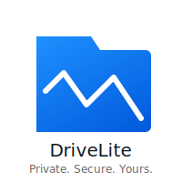

  

# DRIVELITE

**Private. Secure. Yours.**

**DriveLite** is a fast, minimalist and privacy-focused file storage app.
Self-host it or use our free cloud instance with encryption, sharing and sync.

---

## 🔧 Built with the tools and technologies:

---

## Features

> The app is under development features will be added here as soon as the mvp is up

---

## Tach Stack

- **Frontend**: Next.js + TailwindCSS + TypeScript
- **Backend**: Go (Chi router) + PostgreSQL
- **Storage**: MinIO (or any S3-compatible service)

---

## Contributing

- Star the repo
- Open issues and pull requests
- See [CONTRIBUTING.md](./CONTRIBUTING.md)

---

## License

**MIT** - free for personal and commercial use

---

## Roadmap

See the [ROADMAP.md](./ROADMAP.md) for upcoming features and milestones.

---

## 🙌 Support This Project

DriveLite is fully open-source and community-driven.  
If you find it valuable, consider supporting its development:

- ☕ [Ko-fi](https://ko-fi.com/drivelite)
- 🌍 [Buy us coffee](https://buymeacoffee.com/drivelite?new=1)

Your support keeps DriveLite independent and evolving. Thank you! 🙏

---

## 🌐 Official Website

👉 [DriveLite.org](https://drivelite.org)

---

## Star History

